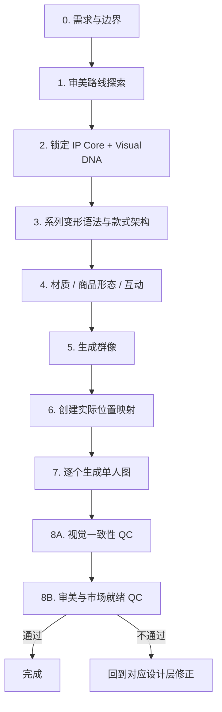

# 玩具角色设计

本 Skill 保留原有“群像 → 单人图 → 一致性检查”的可靠生成骨架，但不再把“chibi + 大眼 + 换装”当作潮玩的默认答案。

核心目标是把流程从“填模板”升级为：

> **需求 → 审美路线探索 → IP Core → Visual DNA → 系列变形语法 → 材质/商品形态 → 群像 → 单人图 → 双重 QC**

具体样式机制、组合规则和评分表放在：

- `references/style-presets.md`
- `references/design-rules.md`
- `references/market-readiness-scorecard.md`
- `schemas/design-spec.yaml`

这些参考文件是设计知识库，不要求把所有字段逐项询问用户。

---

## 0. 执行原则

### 0.1 不把用户变成填表员

先从用户现有描述中推断设计方向，只询问真正会改变结果的缺失信息。

默认每轮最多集中确认少量关键决策；其余字段由 Skill 提案，并允许用户修改。

### 0.2 不默认 Chibi

禁止把以下内容当成默认基础：

- 固定大头小身
- 固定大眼睛
- 固定圆脸
- 固定可爱微笑
- 固定 vinyl figure
- 固定 3D 高细节商品渲染

它们都只是可选路线。

### 0.3 先创造设计机制，再写长 Prompt

当角色尚未定型时，不直接生成“完整精致成品”。先确定：

1. 角色为什么存在
2. 第一眼靠什么被记住
3. 黑色剪影是否有身份
4. 哪些视觉 DNA 永远不变
5. 系列变化遵循什么规则

### 0.4 热门 IP 只学习方法，不复制部件

禁止建立“某某 IP 风格”预设，也不要直接复用知名角色的独占识别组合。

可以抽象学习：

- 可爱与怪异并存
- 低信息量五官 + 强轮廓
- 情绪作为角色本体
- 材质成为视觉语言
- 极端表情成为系列规则
- 软硬材质反差
- 可穿戴/可挂/可互动

但必须重新发明具体轮廓、器官、比例、标志和叙事。

### 0.5 锁定分层

所有设计字段分三层：

- `IDENTITY_LOCKED`：角色身份 DNA，系列中不可随意改变
- `SERIES_LOCKED`：本系列统一语法，只在当前系列锁定
- `VARIANT_FLEXIBLE`：每款允许自由变化

不再把所有细节都设为 LOCKED，以免一致性机制压制创造力。

---

# 1. 工作流程



原有群像和单人图流程继续保留，但它们不再是设计的起点。

---

# 2. 阶段 0：需求与边界

从已有信息提取：

- 原创 / 授权 / 共创
- 单角色还是角色群
- 目标用户与使用场景
- 产品形态是否已确定
- 是否需要系列化 / 盲盒化
- 是否已有世界观、情绪、关键词或参考图
- 用户偏好的确认节点

如果用户只给几个关键词，也可以直接进入路线探索，不要求先补齐完整设定。

可选的商品化字段见 `schemas/design-spec.yaml`，不属于每次必填项。

---

# 3. 阶段 1：审美路线探索（核心新增）

这是防止“同一套模板换皮”的关键阶段。

## 3.1 什么时候必须做路线探索

以下任一情况出现时，先做路线探索，不直接锁定角色：

- 用户只有关键词
- 角色第一版过于普通
- 看起来像动画路人 / AI 脸
- 之前多个候选只是服装、动作不同
- 轮廓、比例、脸部结构高度相似
- 用户希望“更有潮玩感 / 更有辨识度 / 更多类型”

## 3.2 默认输出 4 条明显不同的方向

每条路线必须至少在以下 **3 个高权重维度**上与其他路线不同：

1. silhouette / 轮廓母体
2. proportion / 质量分布与比例
3. face grammar / 五官语法
4. material strategy / 材质策略
5. emotional posture / 情绪姿态
6. series mechanism / 后续系列化机制

只换颜色、发型、服装、动作，不算不同路线。

## 3.3 路线卡格式

```yaml
route_id: R1
core_mechanism: "一句话设计机制"
silhouette: "第一眼轮廓"
proportion: "身体质量如何分布"
face_grammar: "五官如何组织，而非只写大眼/小眼"
personality_tension: "看起来 X，但其实 Y"
material_direction: "材料如何参与视觉"
series_potential: "未来如何形成系列"
risk: "最容易滑向什么俗套"
```

样式机制从 `references/style-presets.md` 中组合，但禁止一次堆叠太多 preset。

## 3.4 路线多样性门槛

进入下一阶段前快速检查：

- 四条路线是否能仅看黑色剪影分成至少 3 类？
- 是否至少有 2 条不是“大头圆脸人形”？
- 是否存在明显不同的五官语法？
- 是否至少有一条由材质或结构驱动，而不是服装驱动？
- 是否至少有一条弱化“可爱”，探索 weird / rebel / melancholy / fashion 等其他轴？

不满足时重新发散。

---

# 4. 阶段 2：IP Core + Visual DNA

用户选定路线后，才正式锁定角色。

## 4.1 IP Core

角色至少需要以下四项：

```yaml
emotion_core: "角色长期承载的核心情绪或价值"
character_desire: "它一直想做成什么"
character_paradox: "看起来 X，但其实 Y"
world_rule: "如果需要世界观，一条可持续产生故事的规则"
```

`character_paradox` 不是强制角色“叛逆”，而是防止角色只有单一形容词。

## 4.2 Visual DNA

Visual DNA 优先级高于服装。

至少定义：

```yaml
silhouette_signature:
  - "2–4 个轮廓识别点"
recognition_tokens:
  - "1–3 个局部身份标志"
proportion_archetype: "soft-round / compact / lanky / top-heavy / creature / irregular / custom"
body_mass_profile: "bean / pear / wedge / column / long-leg / top-heavy / custom"
face_grammar: "五官布局与信息量规则"
asymmetry_degree: 0-3
personality_axes:
  cute: 0-5
  weird: 0-5
  rebellious: 0-5
  melancholy: 0-5
  fashion: 0-5
```

### 轮廓原则

每个原创 IP 推荐 2–4 个 `silhouette_signature`。

至少 2 个应当在纯黑剪影里仍有意义，例如：

- 特殊头部外轮廓
- 不寻常肩胯比例
- 身体质量集中位置
- 标志性肢体长度关系
- 头发/耳/角/帽体与头部融合形成的整体轮廓

不要把“拿着某件道具”当成主要身份轮廓，除非它与角色永久融合。

## 4.3 Face Grammar 不等于五官清单

避免只填：大眼、小鼻、樱桃嘴。

优先描述：

- 信息量：极简 / 中等 / 高表达
- 视觉重心：眼 / 嘴 / 眉 / 面罩 / 留白
- 眼型关系：点状、窄缝、下垂、眼睑主导、无瞳、异形等
- 嘴部关系：无嘴、微小、宽口、牙齿主导、偏位等
- 面部留白比例
- 对称 / 非对称
- 表情变化幅度

## 4.4 角色锚点文件

生成 `character-anchor.md`：

```markdown
# Character Anchor - [角色名]

## IDENTITY_LOCKED
- IP Core: ...
- Silhouette signatures: ...
- Recognition tokens: ...
- Proportion / body mass: ...
- Face grammar: ...
- Identity material cues: ...

## SERIES_LOCKED
- 本系列材质、颜色、变形规则等

## VARIANT_FLEXIBLE
- 表情、姿势、局部配色、道具、服装等允许变化项
```

注意：不再默认写 `chibi proportions`。

---

# 5. 阶段 3：系列变形语法

优秀系列不是“同一角色穿六套衣服”，而是同一 IP 在一条明确规则下产生多个变体。

## 5.1 先写 transformation rule

在设计具体款式前，必须能用一句话回答：

> **这一系列究竟用什么规则把同一个角色变成不同款？**

示例机制（仅方法，不是固定答案）：

- 每种情绪变成一种可见结构
- 每款身体内部出现一种不同微缩世界
- 同一轮廓被不同自然介质侵蚀
- 每款都改变一个质量分布，但保留固定头部 DNA
- 每款代表同一天不同时间状态
- 所有服装都被同一种夸张比例规则重新解释

如果删除颜色和服装后无法解释它们为什么属于同系列，说明仍然只是换装合集。

## 5.2 变化预算

默认使用启发式 `70 / 20 / 10`：

- 70% 身份核心保持
- 20% 服务系列主题变化
- 10% 作为单款惊喜

这不是行业标准，只是防止“完全一样”或“完全不像”的内部设计约束。

## 5.3 系列结构

可按需要定义：

```yaml
series_size: 8
rarity_tiers:
  regular: 8
  secret: 1
secret_upgrade:
  - "结构变化"
  - "材质变化"
  - "光学变化"
```

隐藏款升级优先级：

> **结构 > 材质 > 光学效果 > 互动 > 配件 > 单纯换色**

## 5.4 每款款式卡

```yaml
variant_id: V01
narrative_beat: "这一款正在经历什么"
identity_invariants: "继承哪些 DNA"
series_rule_application: "本款如何体现系列变形语法"
expression: "表情与强度"
pose: "姿态"
material_delta: "材质变化"
outfit_or_surface: "服装或表面处理"
prop: "如有，必须承担身份/叙事/互动功能"
surprise: "本款独有 10%"
```

---

# 6. 阶段 4：材质、商品形态与互动

材质不是渲染词，而是角色语言。

## 6.1 Material Map

用“部件 → 材料 → 颜色 → 表面 → 透明度 → 触感”描述：

```yaml
material_map:
  face:
    material: PVC
    finish: matte
    opacity: 1
  body:
    material: polyester_plush
    tactile: short_soft_pile
  accent:
    material: clear_ABS
    finish: glossy
    opacity: 0.55
```

不知道实际工厂能力时，不虚构精确壁厚、公差等生产参数。

## 6.2 产品形态不再只有四种

常见载体包括但不限于：

- vinyl / PVC / ABS figure
- rotocast / soft vinyl
- plush doll
- vinyl-face plush / 搪胶毛绒
- pendant / bag charm
- squishy charm
- articulated figure
- magnetic object
- mini diorama
- lamp / night-light character object
- phone charm / wearable accessory
- acrylic / flat graphic product

选择产品形态时优先看角色机制是否适配，而不是流行什么就强行套什么。

## 6.3 配件三问

任何配件至少承担一项：

1. **身份功能**：没有它就不像这个角色
2. **叙事功能**：说明这一款发生了什么
3. **互动功能**：可以挂、拆、梳、转、磁吸、发光、替换或组合

三项都没有时，默认删掉。

## 6.4 互动字段（可选）

```yaml
interaction_mode:
  - hang
  - magnet
  - comb
  - removable
  - rotate
  - light
  - dress-up
```

商品化与生产字段见 `schemas/design-spec.yaml`；概念设计阶段无需全部启用。

---

# 7. Outfit Anchor（继续保留，但降级为系列层）

服装不再承担角色身份的主要责任。

当服装确实是系列重要部分时，为每款创建：

```markdown
# Outfit Anchor - [款式名称]

## SERIES_LOCKED / VARIANT_FLEXIBLE
- Type:
- Main color:
- Secondary color:
- Pattern:
- Material / surface:
- Silhouette contribution:
- Collar / neckline:
- Sleeves:
- Fit:
- Special elements:
- Accessories:
```

若服装改变了角色黑色剪影，需要明确它属于 `SERIES_LOCKED` 还是临时变体，避免服装吞掉角色本体。

---

# 8. 姿势库

姿势用于增强叙事，不再作为“制造差异”的主要手段。

| 分类 | 示例 |
|---|---|
| 坐 | 盘腿、悬腿、塌坐、靠坐、蜷坐 |
| 趴 | 托腮趴、压在物件上、四肢摊开 |
| 躺 | 仰躺、侧躺、蜷缩、失重 |
| 动态 | 跳跃、踉跄、前倾、后仰、旋转 |
| 悬浮 | 漂浮、上升、倒置、被某种力量牵引 |
| 互动 | 拥抱、拆装、梳理、拉扯、观察、藏起 |

同系列姿势应服务于 `narrative_beat`，避免只是为了“每个都不同”。

---

# 9. 阶段 5：生成群像

群像用于验证“整个系列是否成立”，不是只做漂亮海报。

## 9.1 群像生成前检查

必须已有：

- Character Anchor
- series transformation rule
- 每款 variant card
- 必要的 Outfit Anchor
- material map / 产品形态

## 9.2 群像设计原则

视觉优先级：

1. 角色轮廓与系列差异
2. 角色之间的呼吸空间
3. 平台/承载关系
4. 少量场景元素
5. 氛围背景

背景不得掩盖轮廓测试。

## 9.3 群像 Prompt 结构

```markdown
## Collection Group Shot Prompt

### Design Intent
[一句话写角色核心 + 系列 transformation rule]

### Identity Rules
[展开 IDENTITY_LOCKED]

### Series Rules
[展开 SERIES_LOCKED]

### Arrangement
[数量] collectible characters, clearly separated silhouettes,
varied pose and height only where consistent with each variant narrative,
no overlapping of signature features

### Characters
- V01: [完整款式卡]
- V02: ...

### Material Rendering
[material map / finish stack]

### Scene
minimal supporting environment, restrained props,
characters remain the dominant visual information

### Lighting
lighting chosen to reveal silhouette, material contrast and facial grammar

### Technical
[按当前图像生成工具实际需要填写，不强制 4K/f2.8]
```

---

# 10. 阶段 6：创建实际位置映射

生成群像后必须先看真实图片，再创建 `position-mapping.md`。

不能把 Prompt 中计划的位置当成实际结果。

| 实际位置 | Variant | 关键识别点 | 材质/颜色 | 姿势 | 单人图 |
|---|---|---|---|---|---|
| 左1 | V01 | ... | ... | ... | 01-v01.png |

缺款、错装、身份 DNA 消失、严重遮挡时，先修群像。

---

# 11. 阶段 7：逐个生成单人图

单人图必须使用群像作为视觉参考。

每次同时提供：

1. 群像图片
2. 实际位置
3. Character Anchor
4. 对应 Variant Card
5. 必要的 Outfit Anchor
6. Material Map

## 单人图 Prompt 结构

```markdown
请参考所附群像，生成其中 [实际位置 + 款式特征] 的单人图。

### IDENTITY_LOCKED
[完整展开]

### SERIES_LOCKED
[完整展开]

### THIS VARIANT
[完整 Variant Card]

### MATERIAL MAP
[完整展开]

必须保持群像中该角色的轮廓、比例、五官语法、身份 token、颜色和关键材质关系一致。
允许改变镜头和背景，但不得把角色重新设计成通用 chibi / 动画人物。
```

问题图默认最多局部修正 2 次；仍失败则记录差异，不无限重试。

---

# 12. 阶段 8A：视觉一致性 QC

至少检查：

| 检查项 | 目标 |
|---|---|
| 轮廓 | signature 没有被服装/姿势吞掉 |
| 比例 | 头身、肢体长度、质量分布一致 |
| Face Grammar | 五官布局与信息量一致 |
| Recognition Tokens | 没有消失、错位或变成其他形态 |
| 材质 | 软/硬、透明/不透明关系一致 |
| 色彩 | 身份色和系列色没有互换 |
| 服装 | 锚点款式与群像一致 |
| 系列规则 | 单人图仍体现 transformation rule |

不一致时优先修 Prompt 或参考图，不修改已批准的身份 DNA 来迁就错误结果。

---

# 13. 阶段 8B：审美与市场就绪 QC

评分细则见 `references/market-readiness-scorecard.md`。

默认九维：

1. 识别度
2. 人格/情绪
3. 形体与五官原创性
4. 配色与材质
5. 系列语法
6. 叙事必要性
7. 可玩/使用潜力
8. 商品实现合理性
9. 传播与参考距离

内部启发式通过线：**≥36/45 且任一项不低于 3**。

这不是行业标准，而是 Skill 的自检门槛。

## 四个强制快测

### A. Silhouette Test
纯黑剪影仍能识别主要身份结构。

### B. Thumbnail Test
缩小到约 80–120 px 后，仍至少保留一个身份信号。

### C. Outfit Removal Test
去掉服装和手持物后，角色仍像同一个 IP。

### D. Reference Distance Test
检查是否同时复用了某一热门角色的多项独占组合：

- 相似头部轮廓
- 相似器官组合
- 相似五官布局
- 相似标志物
- 相似材质签名

若多个高权重特征同时指向同一已知 IP，必须回到 Visual DNA 重做，而不是只换颜色。

---

# 14. 常见失败模式

| 问题 | 根因 | 修复 |
|---|---|---|
| 候选只是换动作换衣服 | 没有路线探索 | 回到阶段 1，强制高权重维度分叉 |
| 角色都是 AI 动画脸 | Face Grammar 太泛 | 降低五官信息量或重构视觉重心 |
| 所有角色都大头圆脸 | 默认 chibi 偏置 | 改用 body mass + proportion archetype |
| 角色靠服装才能识别 | Visual DNA 太弱 | 强化 silhouette / recognition tokens |
| 系列像六套换装 | 没 transformation rule | 先写一句话转换函数，再设计款式 |
| 隐藏款只换色 | surprise 层级太低 | 优先改变结构/材质/光学/互动 |
| 材质只是“3D 渲染词” | 没有 material map | 改为部件级材料关系 |
| 配件越堆越多 | 没有功能审查 | 身份/叙事/互动三问，不满足则删 |
| 一致但越来越无聊 | LOCKED 太多 | 改为 Identity / Series / Flexible 三层 |
| 很像热门 IP | 把市场案例当部件库 | 只保留抽象机制，重做具体形态 |

---

# 15. 输出文件结构

```text
[系列名称]/
├── design-brief.md
├── aesthetic-routes.md
├── character-anchor.md
├── series-design.md
├── material-map.md
├── position-mapping.md
├── prompts/
│   ├── 00-collection-group.md
│   ├── 01-v01.md
│   └── ...
├── 00-collection-group.png
├── 01-v01.png
├── ...
└── REPORT.md
```

其中：

- `aesthetic-routes.md` 记录被选中与被淘汰路线，避免后续重新收敛回同一种设计
- `character-anchor.md` 记录 IP Core + Visual DNA
- `series-design.md` 记录 transformation rule 与各 Variant Card
- `REPORT.md` 同时记录视觉一致性 QC 和市场就绪 QC

---

# 16. 开始执行

默认按以下顺序：

1. 读取用户已有需求，不重复询问
2. 判断是否需要审美路线探索
3. 提出 4 条高差异路线并做多样性检查
4. 用户选定后锁定 IP Core + Visual DNA
5. 定义系列 transformation rule
6. 设计具体款式和材质/商品策略
7. 生成群像
8. 基于真实群像创建位置映射
9. 逐个生成单人图
10. 做视觉一致性 QC
11. 做审美/市场就绪 QC
12. 不通过则回到对应设计层，而不是只堆 Prompt 修图

如果用户已经明确批准某个阶段，继续执行，不重复确认。